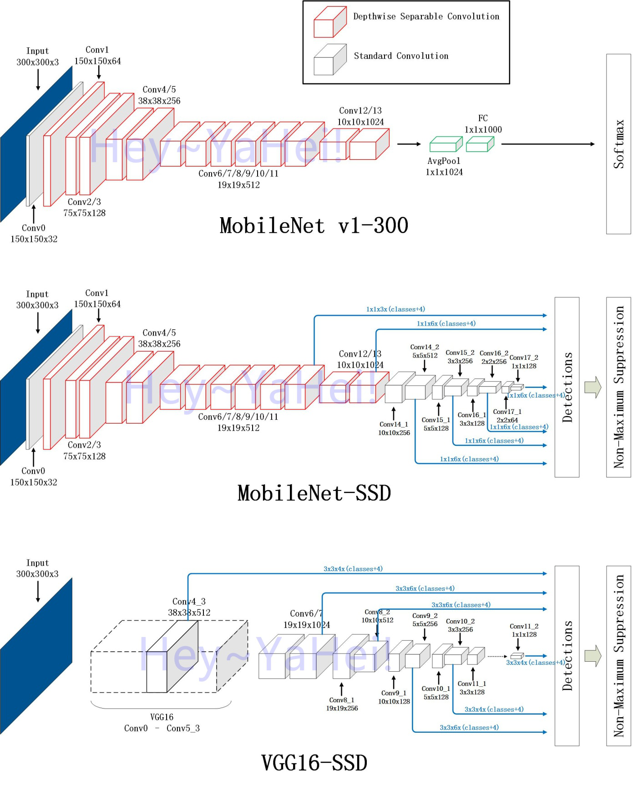

# MobileNet-SSD人脸检测
### 1 MobileNet-SSD结构解析
* 
A caffe implementation of MobileNet-SSD detection network, with pretrained weights on VOC0712 and mAP=0.727.

Network|mAP|Download|Download
:---:|:---:|:---:|:---:
MobileNet-SSD|72.7|[train](https://drive.google.com/open?id=0B3gersZ2cHIxVFI1Rjd5aDgwOG8)|[deploy](https://drive.google.com/open?id=0B3gersZ2cHIxRm5PMWRoTkdHdHc)


### Run
1. Download [SSD](https://github.com/weiliu89/caffe/tree/ssd) source code and compile (follow the SSD README).
2. Download the pretrained deploy weights from the link above.
3. Put all the files in SSD_HOME/examples/
4. Run demo.py to show the detection result.
5. You can run merge_bn.py to generate a no bn model, it will be much faster.

### Train your own dataset
1. Convert your own dataset to lmdb database (follow the SSD README), and create symlinks to current directory.
```
ln -s PATH_TO_YOUR_TRAIN_LMDB trainval_lmdb
ln -s PATH_TO_YOUR_TEST_LMDB test_lmdb
```
2. Create the labelmap.prototxt file and put it into current directory.
3. Use gen_model.sh to generate your own training prototxt.
4. Download the training weights from the link above, and run train.sh, after about 30000 iterations, the loss should be 1.5 - 2.5.
5. Run test.sh to evaluate the result.
6. Run merge_bn.py to generate your own no-bn caffemodel if necessary.
```
python merge_bn.py --model example/MobileNetSSD_deploy.prototxt --weights snapshot/mobilenet_iter_xxxxxx.caffemodel
```

### About some details
There are 2 primary differences between this model and [MobileNet-SSD on tensorflow](https://github.com/tensorflow/models/blob/master/object_detection/g3doc/detection_model_zoo.md):
1. ReLU6 layer is replaced by ReLU.
2. For the conv11_mbox_prior layer, the anchors is [(0.2, 1.0), (0.2, 2.0), (0.2, 0.5)] vs tensorflow's [(0.1, 1.0), (0.2, 2.0), (0.2, 0.5)].

### Reproduce the result
I trained this model from a MobileNet classifier([caffemodel](https://drive.google.com/open?id=0B3gersZ2cHIxZi13UWF0OXBsZzA) and [prototxt](https://drive.google.com/open?id=0B3gersZ2cHIxWGEzbG5nSXpNQzA)) converted from [tensorflow](http://download.tensorflow.org/models/mobilenet_v1_1.0_224_2017_06_14.tar.gz). I first trained the model on MS-COCO and then fine-tuned on VOC0712. Without MS-COCO pretraining, it can only get mAP=0.68.

### Mobile Platform
You can run it on Android with my another project [rscnn](https://github.com/chuanqi305/rscnn).
